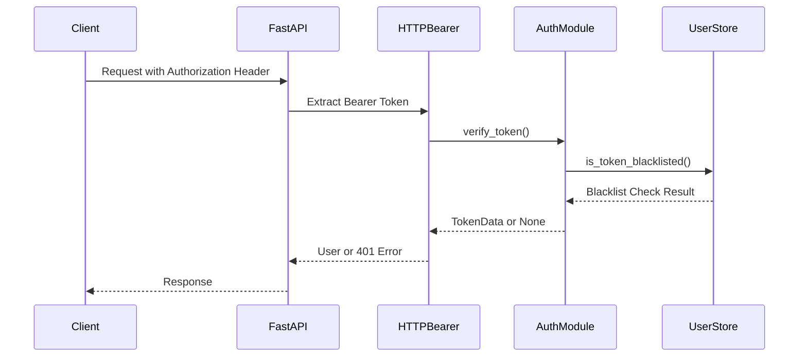
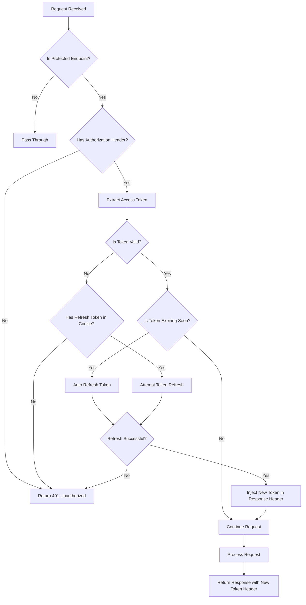

# トークン受け渡し自動化実装案 - HTTPヘッダー自動注入方式

## 1. 実装概要

### 1.1 目的
現在の手動トークン管理を自動化し、クライアント側でのトークン管理負荷を軽減するため、FastAPIミドルウェアによるHTTPヘッダー自動注入機能を実装する。

### 1.2 対象システム
- **システム名**: トランスクリプト議事録生成API
- **技術基盤**: FastAPI + OAuth2 + JWT認証
- **現在の認証方式**: HTTPBearer + アクセストークンブラックリスト機能

### 1.3 実装方式
**HTTPヘッダー自動注入方式**を採用し、以下の機能を提供する：
- リクエスト時の自動トークン検証・更新
- 期限切れトークンの自動リフレッシュ
- 新しいトークンのレスポンスヘッダー自動注入
- 既存認証システムとの完全互換性

## 2. 現状分析

### 2.1 現在の認証フロー


### 2.2 現状の課題
- **手動トークン管理**: クライアント側でトークン期限を監視する必要
- **リフレッシュの複雑性**: 期限切れ時の手動リフレッシュ処理が必要
- **UX問題**: トークン期限切れによる予期しない認証エラー
- **開発効率**: フロントエンド開発時のトークン管理コストが高い

## 3. 実装アーキテクチャ

### 3.1 自動注入ミドルウェア設計

#### 3.1.1 ミドルウェア配置
```python
# src/middleware/token_auto_injection.py
from fastapi import Request, Response
from fastapi.responses import JSONResponse
from starlette.middleware.base import BaseHTTPMiddleware
from typing import Callable
import logging

class TokenAutoInjectionMiddleware(BaseHTTPMiddleware):
    """トークン自動注入ミドルウェア"""
    
    def __init__(self, app, excluded_paths: list = None):
        super().__init__(app)
        self.excluded_paths = excluded_paths or [
            "/auth/login", 
            "/auth/register", 
            "/auth/refresh",
            "/docs", 
            "/openapi.json",
            "/"
        ]
        self.logger = logging.getLogger(__name__)
```

#### 3.1.2 処理フロー設計


### 3.2 トークン管理拡張

#### 3.2.1 トークンユーティリティ拡張
```python
# src/modules/token_utils.py
from datetime import datetime, timedelta
from typing import Optional, Tuple
from jose import jwt, JWTError
from src.config import settings

class TokenUtils:
    @staticmethod
    def is_token_expiring_soon(token: str, threshold_minutes: int = 5) -> bool:
        """トークンが指定時間内に期限切れになるかチェック"""
        try:
            payload = jwt.decode(token, settings.jwt_secret_key, algorithms=[settings.jwt_algorithm])
            exp = payload.get("exp")
            if not exp:
                return True
            
            exp_datetime = datetime.fromtimestamp(exp)
            threshold = datetime.utcnow() + timedelta(minutes=threshold_minutes)
            return exp_datetime <= threshold
        except JWTError:
            return True
    
    @staticmethod
    def extract_refresh_token_from_cookies(request) -> Optional[str]:
        """Cookieからリフレッシュトークンを抽出"""
        return request.cookies.get("refresh_token")
    
    @staticmethod
    def create_token_response_headers(access_token: str, refresh_token: str) -> dict:
        """新しいトークンをレスポンスヘッダーに設定"""
        return {
            "X-New-Access-Token": access_token,
            "X-New-Refresh-Token": refresh_token,
            "X-Token-Refreshed": "true"
        }
```

### 3.3 既存システムとの統合

#### 3.3.1 main.py への統合
```python
# src/main.py (修正版)
from fastapi import FastAPI
from fastapi.middleware.cors import CORSMiddleware
from src.middleware.token_auto_injection import TokenAutoInjectionMiddleware
from src.routers import minutes, auth
from src.modules.logger import setup_logger

app = FastAPI(
    title="議事録生成API",
    description="Azure OpenAIを使用してトランスクリプトから議事録を生成するAPI with OAuth2 authentication",
    version="1.0.0"
)

# ミドルウェア追加順序が重要
app.add_middleware(
    TokenAutoInjectionMiddleware,
    excluded_paths=["/auth/login", "/auth/register", "/auth/refresh", "/docs", "/openapi.json", "/"]
)

app.add_middleware(
    CORSMiddleware,
    allow_origins=["*"],
    allow_credentials=True,
    allow_methods=["*"],
    allow_headers=["*"],
    expose_headers=["X-New-Access-Token", "X-New-Refresh-Token", "X-Token-Refreshed"]
)
```

## 4. 実装詳細

### 4.1 ミドルウェア実装

#### 4.1.1 コア処理ロジック
```python
async def dispatch(self, request: Request, call_next: Callable) -> Response:
    """メインの処理ロジック"""
    
    # 除外パスのチェック
    if self._is_excluded_path(request.url.path):
        return await call_next(request)
    
    # Authorizationヘッダーの確認
    auth_header = request.headers.get("Authorization")
    if not auth_header or not auth_header.startswith("Bearer "):
        return JSONResponse(
            status_code=401,
            content={"detail": "Authorization header required"}
        )
    
    access_token = auth_header.split(" ")[1]
    
    try:
        # トークンの有効性とブラックリストチェック
        if user_store.is_token_blacklisted(access_token):
            return await self._handle_invalid_token(request)
        
        # トークンの期限チェック
        if TokenUtils.is_token_expiring_soon(access_token):
            return await self._handle_token_refresh(request, call_next)
        
        # 通常の処理続行
        response = await call_next(request)
        return response
        
    except Exception as e:
        self.logger.error(f"Token auto-injection error: {e}")
        return JSONResponse(
            status_code=500,
            content={"detail": "Token processing error"}
        )
```

#### 4.1.2 トークンリフレッシュ処理
```python
async def _handle_token_refresh(self, request: Request, call_next: Callable) -> Response:
    """トークンリフレッシュ処理"""
    
    # Cookieからリフレッシュトークンを取得
    refresh_token = TokenUtils.extract_refresh_token_from_cookies(request)
    if not refresh_token:
        return JSONResponse(
            status_code=401,
            content={"detail": "Refresh token required for auto-refresh"}
        )
    
    # リフレッシュトークンでアクセストークンを更新
    token_data = refresh_access_token(refresh_token)
    if not token_data:
        return JSONResponse(
            status_code=401,
            content={"detail": "Invalid refresh token"}
        )
    
    # 新しいトークンでリクエストヘッダーを更新
    new_access_token = token_data["access_token"]
    new_refresh_token = token_data["refresh_token"]
    
    # リクエストのAuthorizationヘッダーを更新
    mutable_headers = dict(request.headers)
    mutable_headers["authorization"] = f"Bearer {new_access_token}"
    request._headers = mutable_headers
    
    # リクエスト処理続行
    response = await call_next(request)
    
    # レスポンスヘッダーに新しいトークンを追加
    token_headers = TokenUtils.create_token_response_headers(
        new_access_token, new_refresh_token
    )
    for key, value in token_headers.items():
        response.headers[key] = value
    
    self.logger.info("Token auto-refreshed successfully")
    return response
```

### 4.2 設定管理拡張

#### 4.2.1 config.py 拡張
```python
# src/config.py (追加設定)
class Settings(BaseSettings):
    # 既存設定...
    
    # トークン自動注入設定
    token_auto_refresh_enabled: bool = True
    token_refresh_threshold_minutes: int = 5
    token_auto_injection_excluded_paths: list = [
        "/auth/login", "/auth/register", "/auth/refresh", 
        "/docs", "/openapi.json", "/"
    ]
    
    # Cookie設定
    refresh_token_cookie_name: str = "refresh_token"
    refresh_token_cookie_secure: bool = True
    refresh_token_cookie_httponly: bool = True
    refresh_token_cookie_samesite: str = "lax"
```

### 4.3 クライアント側対応

#### 4.3.1 JavaScript/TypeScript クライアント例
```typescript
// client/token-manager.ts
class TokenManager {
    private accessToken: string | null = null;
    private refreshToken: string | null = null;
    
    async makeRequest(url: string, options: RequestInit = {}): Promise<Response> {
        // Authorizationヘッダーを自動設定
        const headers = {
            ...options.headers,
            'Authorization': `Bearer ${this.accessToken}`
        };
        
        const response = await fetch(url, {
            ...options,
            headers,
            credentials: 'include' // Cookieを含める
        });
        
        // 新しいトークンがレスポンスヘッダーにある場合は更新
        const newAccessToken = response.headers.get('X-New-Access-Token');
        const newRefreshToken = response.headers.get('X-New-Refresh-Token');
        
        if (newAccessToken && newRefreshToken) {
            this.accessToken = newAccessToken;
            this.refreshToken = newRefreshToken;
            this.saveTokensToStorage();
            console.log('Tokens auto-refreshed');
        }
        
        return response;
    }
    
    private saveTokensToStorage(): void {
        localStorage.setItem('access_token', this.accessToken || '');
        // リフレッシュトークンはCookieで管理（セキュリティ向上）
    }
}
```

## 5. セキュリティ考慮事項

### 5.1 セキュリティ強化策

#### 5.1.1 トークン保護
- **アクセストークン**: LocalStorageまたはメモリ内保存
- **リフレッシュトークン**: HttpOnly Cookieで保存
- **CSRF対策**: SameSite Cookie属性の適用
- **XSS対策**: トークンの適切な保存場所選択

#### 5.1.2 ブラックリスト連携
```python
# 既存のブラックリスト機能との統合
async def _validate_token_security(self, access_token: str) -> bool:
    """トークンのセキュリティ検証"""
    
    # ブラックリストチェック（既存機能）
    if user_store.is_token_blacklisted(access_token):
        self.logger.warning(f"Blacklisted token access attempt")
        return False
    
    # JWT署名検証
    token_data = verify_token(access_token)
    if not token_data:
        self.logger.warning(f"Invalid token signature")
        return False
    
    return True
```

### 5.2 レート制限・監視

#### 5.2.1 自動リフレッシュ制限
```python
# リフレッシュ頻度制限
class RefreshRateLimiter:
    def __init__(self):
        self.refresh_attempts = {}  # {user_id: [timestamp, ...]}
        self.max_refreshes_per_hour = 10
    
    def can_refresh(self, user_id: str) -> bool:
        """リフレッシュ可能かチェック"""
        now = datetime.utcnow()
        hour_ago = now - timedelta(hours=1)
        
        user_attempts = self.refresh_attempts.get(user_id, [])
        recent_attempts = [t for t in user_attempts if t > hour_ago]
        
        return len(recent_attempts) < self.max_refreshes_per_hour
```

## 6. エラーハンドリング

### 6.1 エラー分類と対応

#### 6.1.1 エラーレスポンス設計
```python
class TokenAutoInjectionError(Exception):
    """トークン自動注入エラー"""
    pass

class ErrorResponses:
    MISSING_AUTH_HEADER = {
        "error": "missing_authorization",
        "message": "Authorization header is required",
        "code": 4001
    }
    
    INVALID_TOKEN_FORMAT = {
        "error": "invalid_token_format", 
        "message": "Authorization header must be 'Bearer <token>'",
        "code": 4002
    }
    
    TOKEN_BLACKLISTED = {
        "error": "token_blacklisted",
        "message": "Token has been revoked",
        "code": 4003
    }
    
    REFRESH_TOKEN_MISSING = {
        "error": "refresh_token_missing",
        "message": "Refresh token required for auto-refresh",
        "code": 4004
    }
    
    REFRESH_FAILED = {
        "error": "refresh_failed",
        "message": "Failed to refresh access token",
        "code": 4005
    }
```

### 6.2 ログ・監視

#### 6.2.1 詳細ログ設計
```python
# ログ出力例
self.logger.info(f"Token auto-refresh triggered for user: {user_id}")
self.logger.warning(f"Refresh rate limit exceeded for user: {user_id}")
self.logger.error(f"Token refresh failed: {error_message}")
self.logger.debug(f"Token expiring in {minutes} minutes, triggering refresh")
```

## 7. テスト計画

### 7.1 単体テスト

#### 7.1.1 ミドルウェアテスト
```python
# tests/test_token_auto_injection.py
import pytest
from fastapi.testclient import TestClient
from src.main import app

class TestTokenAutoInjectionMiddleware:
    
    def test_excluded_paths_bypass(self):
        """除外パスがミドルウェアをバイパスすることを確認"""
        client = TestClient(app)
        response = client.get("/")
        assert response.status_code == 200
    
    def test_missing_auth_header_returns_401(self):
        """認証ヘッダーなしで401が返されることを確認"""
        client = TestClient(app)
        response = client.get("/minutes/health")
        assert response.status_code == 401
    
    def test_valid_token_passes_through(self):
        """有効なトークンが正常に処理されることを確認"""
        # テスト実装...
    
    def test_expiring_token_auto_refresh(self):
        """期限切れ間近のトークンが自動更新されることを確認"""
        # テスト実装...
    
    def test_blacklisted_token_rejected(self):
        """ブラックリストされたトークンが拒否されることを確認"""
        # テスト実装...
```

### 7.2 統合テスト

#### 7.2.1 エンドツーエンドテスト
```python
def test_complete_auto_refresh_flow():
    """完全な自動リフレッシュフローのテスト"""
    
    # 1. ログインしてトークン取得
    login_response = client.post("/auth/login", json={
        "username": "testuser",
        "password": "testpass"
    })
    
    # 2. 期限切れ間近のトークンを作成
    expiring_token = create_expiring_token("testuser", minutes=2)
    
    # 3. 保護されたエンドポイントにアクセス
    response = client.get("/minutes/health", headers={
        "Authorization": f"Bearer {expiring_token}"
    })
    
    # 4. 自動リフレッシュが実行されることを確認
    assert response.status_code == 200
    assert "X-New-Access-Token" in response.headers
    assert "X-Token-Refreshed" in response.headers
```

## 8. 実装手順

### 8.1 Phase 1: 基盤実装
1. **トークンユーティリティ作成**
   - `src/modules/token_utils.py` 実装
   - トークン期限チェック機能
   - Cookie処理機能

2. **ミドルウェア基本構造作成**
   - `src/middleware/__init__.py` 作成
   - `src/middleware/token_auto_injection.py` 基本構造
   - 除外パス処理実装

### 8.2 Phase 2: コア機能実装
1. **トークン検証・リフレッシュロジック**
   - アクセストークン有効性チェック
   - 期限切れ検出機能
   - 自動リフレッシュ処理

2. **レスポンスヘッダー注入**
   - 新しいトークンのヘッダー設定
   - CORS設定更新（expose_headers）

### 8.3 Phase 3: セキュリティ・エラーハンドリング
1. **セキュリティ強化**
   - レート制限実装
   - ブラックリスト連携強化
   - 詳細ログ実装

2. **エラーハンドリング**
   - 包括的エラー処理
   - 適切なHTTPステータスコード
   - クライアント向けエラーメッセージ

### 8.4 Phase 4: テスト・検証
1. **単体テスト実装**
   - ミドルウェア機能テスト
   - トークンユーティリティテスト

2. **統合テスト・動作確認**
   - エンドツーエンドテスト
   - パフォーマンステスト
   - セキュリティテスト

## 9. 設定・デプロイ

### 9.1 環境変数追加

#### 9.1.1 .env ファイル更新
```env
# 既存設定...

# トークン自動注入設定
TOKEN_AUTO_REFRESH_ENABLED=true
TOKEN_REFRESH_THRESHOLD_MINUTES=5
REFRESH_TOKEN_COOKIE_SECURE=true
REFRESH_TOKEN_COOKIE_HTTPONLY=true
REFRESH_TOKEN_COOKIE_SAMESITE=lax
```

### 9.2 本番環境考慮事項

#### 9.2.1 パフォーマンス最適化
- **トークン検証キャッシュ**: 同一トークンの重複検証を避ける
- **非同期処理**: トークンリフレッシュの非同期実行
- **メモリ使用量監視**: ミドルウェアのメモリリーク防止

#### 9.2.2 監視・ログ
- **メトリクス収集**: 自動リフレッシュ成功/失敗率
- **アラート設定**: 異常なリフレッシュ頻度の検出
- **ログローテーション**: トークン関連ログの適切な管理

## 10. 今後の拡張予定

### 10.1 機能拡張
- **複数デバイス対応**: デバイス別トークン管理
- **トークン階層化**: 異なる権限レベルのトークン
- **WebSocket対応**: リアルタイム通信でのトークン管理

### 10.2 セキュリティ強化
- **トークンローテーション**: 定期的な自動トークン更新
- **異常検知**: 不正なトークン使用パターンの検出
- **監査ログ**: 詳細なトークン使用履歴

## 11. 注意事項・制約

### 11.1 技術的制約
- **FastAPI依存**: FastAPIのミドルウェア機能に依存
- **Cookie依存**: リフレッシュトークンのCookie保存が必要
- **ブラウザ互換性**: 一部古いブラウザでの制限

### 11.2 運用上の注意
- **デバッグ複雑性**: 自動処理によるデバッグの困難さ
- **ログ管理**: 大量のトークン関連ログの管理
- **パフォーマンス影響**: 全リクエストでのトークン検証オーバーヘッド

---

**作成日**: 2025年1月25日  
**バージョン**: 1.0  
**作成者**: Devin AI  
**関連ドキュメント**: 改修トレーサビリティ/access_token_blacklist_implementation.md
